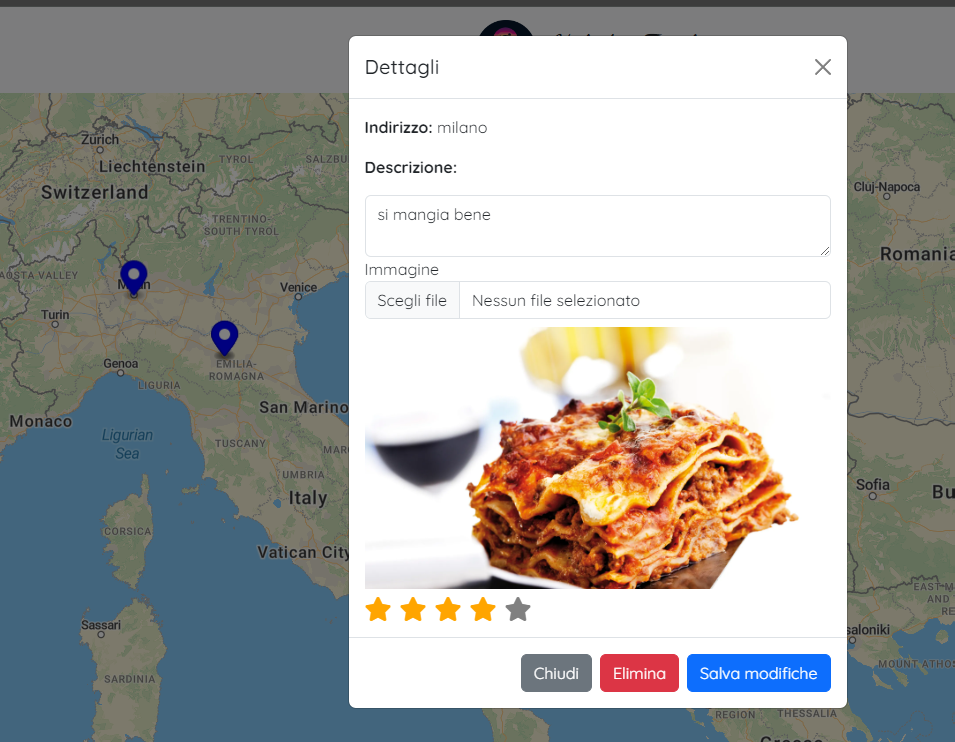
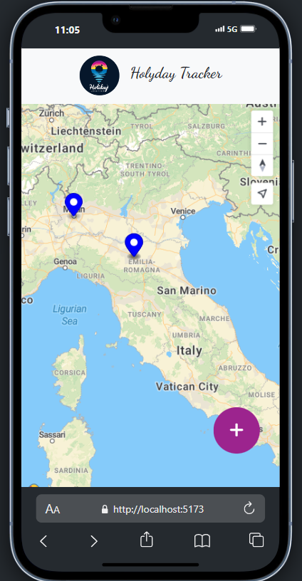

# Travel App 

## Overview

The Travel App allows users to add, edit, and delete markers on a map using the MapTiler SDK. Users can input locations with titles, descriptions, and images, and the application saves this data locally using the browser's Local Storage.

## Features

- **Add Markers**: Users can add geographical markers by entering an address. The application will geocode the address using the TomTom API to retrieve the latitude and longitude.
- **Edit Marker**: After adding a marker, users can click on it to edit its details such as description and image.
- **Delete Marker**: Users can delete markers from the map.
- **Image Upload**: Users can upload images for each marker.
- **Star Rating**: Users can rate the locations by clicking on star icons, which update a rating index.

## Technologies Used

- Vue 3
- Vue Composition API
- Axios (for API requests)
- MapTiler SDK
- Bootstrap for modals and buttons
- Local Storage for data persistence

  ## Screenshots



## Getting Started

To run the project locally, follow these steps:

1. **Clone the repository**:
   ```bash
   git clone https://github.com/yourusername/your-repo.git
   cd your-repo
   ```

2. **Install dependencies**:
   Make sure you have [Node.js](https://nodejs.org/) installed. Then run:
   ```bash
   npm install
   ```

3. **Set up the API keys**:
   Replace the placeholder API key in the code with your own MapTiler and TomTom API keys.

4. **Run the application**:
   Use the following command to start the development server:
   ```bash
   npm run serve
   ```

5. **Open your browser**:
   Navigate to `http://localhost:8080` (or the port number indicated in your terminal) to view the application.

## Usage

- Click the "+" button at the bottom right of the map to open the modal for adding a new location.
- Input the required details (address, description, image) and click "Salva" to save the marker.
- Click on a marker on the map to open a modal to edit or delete the marker.

## API Documentation

### TomTom API
The TomTom API is used for geocoding addresses to retrieve their longitude and latitude. Make sure to sign up for an account and acquire an API key from [TomTom's Developer Portal](https://developer.tomtom.com/).

### MapTiler SDK
The MapTiler SDK is integrated to handle map rendering and marker management. Sign up and get your API key from [MapTiler](https://www.maptiler.com/).

